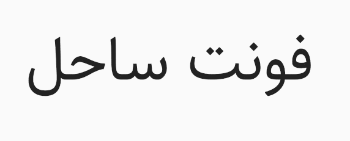

# Sahel-Font
A Persian (Farsi) Font with variable version



فونت فارسی ساحل  
[نمایش فونت](http://rastikerdar.github.io/sahel-font/)  
[صفحه دریافت (دانلود) بسته فونت شامل فایل های ttf,woff,eot](https://github.com/rastikerdar/sahel-font/releases)  
با تشکر از برنامه [FontForge](https://fontforge.github.io)  
نسخه وریبل فونت با نام `Sahel-VF‍` در بسته فونت موجود می‌باشد.  
نسخه‌های بدون حروف لاتین یا تمام ارقام فارسی درون بسته فشرده موجود می‌باشد.  
فرآیند تولید بسته نهایی شامل انواع نسخه‌ها و فرمت‌ها توسط ابزار [fontbuilder](https://github.com/rastikerdar/fontbuilder) انجام می‌شود.

## Known problems for variable version
- mark placement distortion.

## To Do
- [x] Adding all 3 Weights as masters to variable version.
- [ ] Font testing page
- [ ] Latin section is empty. It's better to use an opensource variable font with a wide range.
- [ ] Testing font in all supported programs.
- [ ] Adding other axes.

## طریقه استفاده در صفحات وب

<p dir="rtl">
کد زیر را در قسمت style یا فایل css وارد نمایید:
</p>


```css
@font-face {
  font-family: Sahel;
  src: url('Sahel.eot');
  src: url('Sahel.eot?#iefix') format('embedded-opentype'),
       url('Sahel.woff') format('woff'),
       url('Sahel.ttf') format('truetype');
  font-weight: normal;
}
      
@font-face {
  font-family: Sahel;
  src: url('Sahel-Bold.eot');
  src: url('Sahel-Bold.eot?#iefix') format('embedded-opentype'),
       url('Sahel-Bold.woff') format('woff'),
       url('Sahel-Bold.ttf') format('truetype');
  font-weight: bold;
}
      
@font-face {
  font-family: Sahel;
  src: url('Sahel-SemiBold.eot');
  src: url('Sahel-SemiBold.eot?#iefix') format('embedded-opentype'),
       url('Sahel-SemiBold.woff') format('woff'),
       url('Sahel-SemiBold.ttf') format('truetype');
  font-weight: 600;
}

@font-face {
  font-family: Sahel;
  src: url('Sahel-Black.eot');
  src: url('Sahel-Black.eot?#iefix') format('embedded-opentype'),
       url('Sahel-Black.woff') format('woff'),
       url('Sahel-Black.ttf') format('truetype');
  font-weight: 900;
}
```

## طریقه استفاده از نسخه متغیر variable

```css
@font-face {
  font-family: Sahel VF;
  src: url('Sahel-VF.woff2') format('woff2');
}

.foo {
  font-family: Sahel VF;
  font-variation-settings: "wght" 600;
}

.bar {
  font-family: Sahel VF;
  font-variation-settings: "wght" 900;
}

```

## Install

Grab the [latest release](https://github.com/rastikerdar/sahel-font/releases/latest) file.

Or [RawGit](https://rawgit.com) CDN:

```html
<link href="https://cdn.rawgit.com/rastikerdar/sahel-font/v[X.Y.Z]/dist/font-face.css" rel="stylesheet" type="text/css" />
```

Replace [X.Y.Z] with the latest version (e.g. 2.0.1) and integrate the font into your CSS:

```
font-family: 'Sahel', sans-serif;
```

#### Arch Linux

Arch user's could use [sahel-fonts](https://aur.archlinux.org/packages/sahel-fonts/) package from [AUR](https://aur.archlinux.org/) repository to install sahel font. Use your favorite [AUR helper](https://wiki.archlinux.org/index.php/AUR_helpers) like pacaur or yaourt for installing package:

```shell
pacaur -S sahel-fonts
```

## Contributors

- Amin Abedi [@aminabedi68](https://github.com/aminabedi68)

## License
2016 Saber Rastikerdar ([@rastikerdar](https://github.com/rastikerdar)). See the `LICENSE` file.

